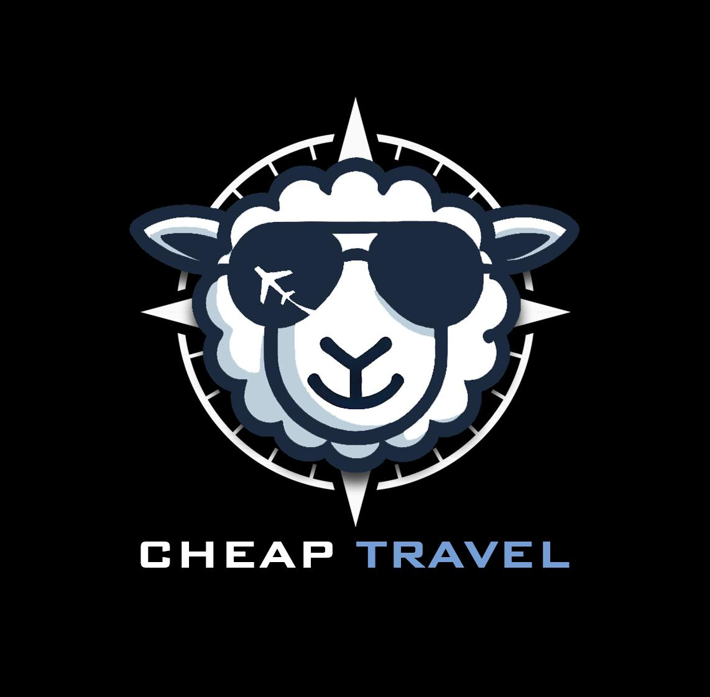
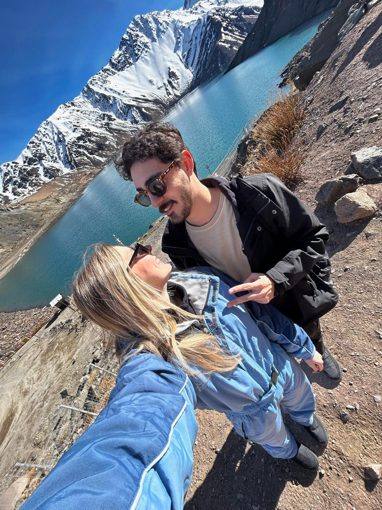

<!DOCTYPE html>
<html lang="pt-br">
<head>
  <meta charset="UTF-8">
  <meta name="viewport" content="width=device-width, initial-scale=1.0">
  <title>Cheap Travel</title>
  
</head>
<body>
  <header>
    
    <h1>Cheap Travel</h1>
    
Viajar mais, gastando menos, é possível!

    <nav>
      <a href="#sobre">Sobre</a>
      <a href="#funciona">Como Funciona</a>
      <a href="#contato">Contato</a>
    </nav>
    <a class="btn" href="https://www.instagram.com/_cheaptravel" target="_blank">Siga no Instagram</a>
  </header>

  <section id="sobre">
    <h2>Sobre a Cheap Travel</h2>
    
Somos um casal apaixonado por viagens. Desde 2021, decidimos que todo ano seria marcado por uma nova aventura. Assim nasceu a Cheap Travel: uma agência para quem quer viver experiências incríveis, pagando o justo e aproveitando cada centavo da viagem.

    <ul>
      <li><strong>Missão:</strong> tornar o ato de viajar algo acessível</li>
      <li><strong>Visão:</strong> ser referência em roteiros econômicos</li>
      <li><strong>Valores:</strong> transparência, empatia, economia</li>
    </ul>
    
  </section>

  <section id="funciona">
    <h2>Como Funciona</h2>
    
Nosso processo é simples e prático. Veja como funciona:

    <ol>
      <li>Briefing com seus interesses, datas e orçamento</li>
      <li>Pesquisa e montagem do melhor planejamento</li>
      <li>Roteiro completo com estimativas de gasto</li>
      <li>Suporte até o embarque</li>
    </ol>
  </section>

  <section id="contato">
    <h2>Fale com a gente</h2>
    
Vamos planejar sua próxima viagem juntos?

    

      💬 <strong>WhatsApp:</strong> <a href="https://wa.me/5547996139312?text=Ol%C3%A1%2C+quero+ajuda+para+planejar+minha+viagem+%F0%9F%9A%80" target="_blank">Clique aqui para conversar</a> 
      📧 <strong>E-mail:</strong> cs.cheaptravel@gmail.com 
      📸 <strong>Instagram:</strong> <a href="https://www.instagram.com/_cheaptravel" target="_blank">@_cheaptravel</a>
    

  </section>

  <footer>
    
&copy; 2025 Cheap Travel. Todos os direitos reservados.

  </footer>
</body>
</html>
